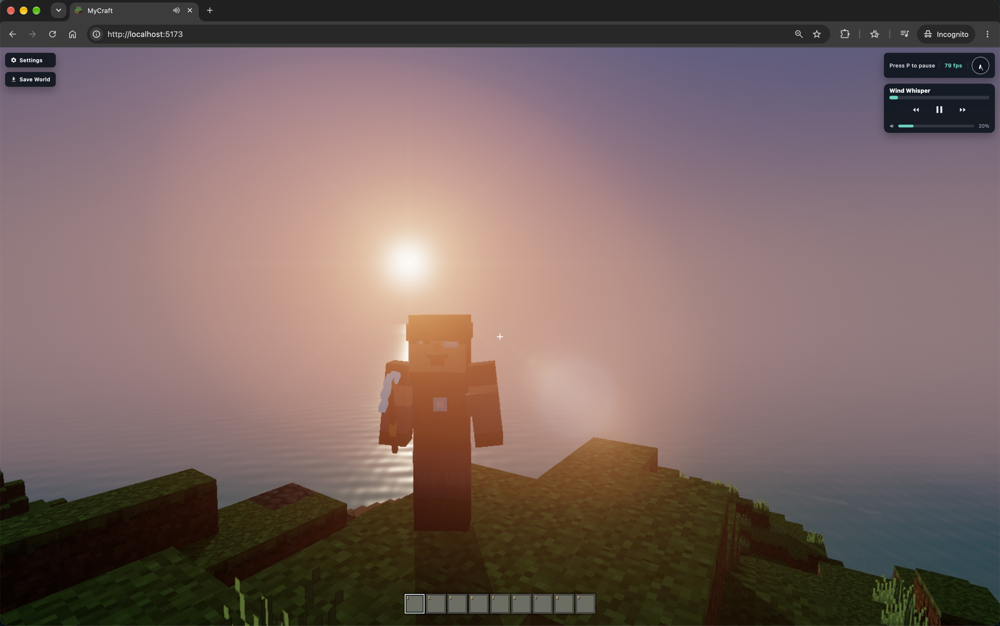

# MyCraft

## Build a world. Find your horizon.

MyCraft is a quiet voxel sandbox for wandering, shaping terrain, and watching a living world move from dawn to night.

Explore coastlines, climb into the hills, dive beneath the surface, and make a place your own one block at a time. Gather materials, build freely, and let the atmosphere do the rest.

### Make it yours

- Discover terrain that rewards a slower pace.
- Mine, collect, and build with a tactile block-by-block rhythm.
- Swim through clear water and follow the sound of the shore.
- Watch the sky, light, and landscape change around you.

MyCraft is made for small adventures that turn into stories.

[Explore the engineering notes](docs/README.md)
